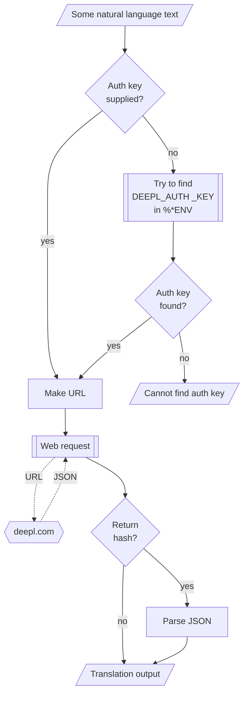

# Lingua::Translation::DeepL Raku package

## In brief

This Raku package provides access to the language translation service [DeepL](https://www.deepl.com), [DL1].
For more details of the DeepL's API usage see [the documentation](https://www.deepl.com/docs-api), [DL2].

**Remark:** To use the DeepL API one has to register and obtain authorization key. 

**Remark:** This Raku package is much "less ambitious" than the official Python package, [DLp1], developed by DeepL's team. 
Gradually, over time, I expect to add features to the Raku package that correspond to features of DLp1.

-----

## Usage examples

### Translations

**Remark:** When the authorization key, `auth-key`, is specified to be `Whatever` 
then `deepl-translation` attempts to use the env variable `DEEPL_AUTH_KEY`.

Here is a simple call (automatic language detection by DeepL and translation to English):

```perl6
use Lingua::Translation::DeepL;
say deepl-translation('Колко групи могат да се намерят в този облак от точки.');
```

Here we translate from Bulgarian, Russian, and Portuguese to English:

```perl6
my @res = |deepl-translation(
        ['Препоръчай двеста неща от рекомендационната система smrGoods.',
         'Сделать классификатор с логистической регрессии',
         'Fazer um classificador florestal aleatório com 200 árvores'],
        from-lang => Whatever,
        to-lang => 'English',
        auth-key => Whatever);
        
.say for @res;
```

**Remark:** DeepL allows up to 50 texts to be translated in one API call.
Hence, if the first argument is an array with more than 50 elements, then it is partitioned
into up-to-50-elements chunks and those are given to `deepl-translation`.   

### Languages

The function `deepl-translation` verifies that the argument languages given to it are 
valid DeepL from- and to-languages. 
See the section ["Request Translation"](https://www.deepl.com/docs-api/translate-text/translate-text/).

Here we get the mappings of abbreviations to source language names:

```perl6
deepl-source-languages()
```

Here we get the mappings of abbreviations to target language names:

```perl6
deepl-target-languages()
```

-------

## Command Line Interface

The package provides a Command Line Interface (CLI) script:

```shell
> deepl-translation
# Usage:
#   deepl-translation <text> [-f|--from-lang=<Str>] [-t|--to-lang=<Str>] [-a|--auth-key=<Str>] [--timeout[=UInt]] [--format=<Str>] -- Text translation using the DeepL API.
#  
#    <text>                  Text to be translated.
#    -f|--from-lang=<Str>    Source language. [default: 'Whatever']
#    -t|--to-lang=<Str>      Target language. [default: 'English']
#    -a|--auth-key=<Str>     Authorization key (to use DeepL API.) [default: 'Whatever']
#    --timeout[=UInt]        Timeout. [default: 10]
#    --format=<Str>          Format of the result; one of "json" or "hash". [default: 'json']
```

**Remark:** When the authorization key argument "auth-key" is specified set to "Whatever"
then `deepl-translation` attempts to use the env variable `DEEPL_AUTH_KEY`.

--------

## Mermaid diagram



--------

## References

[DL1] DeepL, [DeepL Translator](https://www.deepl.com/translator).

[DL2] DeepL, [DeepL API](https://www.deepl.com/docs-api/).

[DLp1] DeepL,
[DeepL Python Library](https://github.com/DeepLcom/deepl-python),
(2021),
[GitHub/DeepLcom](https://github.com/DeepLcom/).