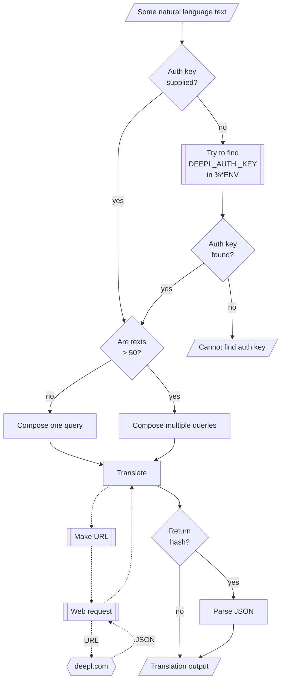

# Lingua::Translation::DeepL

## In brief

This Raku package provides access to the language translation service [DeepL](https://www.deepl.com), [DL1].
For more details of the DeepL's API usage see [the documentation](https://www.deepl.com/docs-api), [DL2].

**Remark:** To use the DeepL API one has to register and obtain authorization key. 

**Remark:** This Raku package is much "less ambitious" than the official Python package, [DLp1], developed by DeepL's team. 
Gradually, over time, I expect to add features to the Raku package that correspond to features of [DLp1].

-----

## Installation

Package installations from both sources use [zef installer](https://github.com/ugexe/zef) 
(which should be bundled with the "standard" Rakudo installation file.)

To install the package from [Zef ecosystem](https://raku.land/) use the shell command:

```
zef install Lingua::Translation::DeepL
```

To install the package from the GitHub repository use the shell command:

```
zef install https://github.com/antononcube/Raku-Lingua-Translation-DeepL.git
```

----

## Usage examples

**Remark:** When the authorization key, `auth-key`, is specified to be `Whatever` 
then `deepl-translation` attempts to use the env variable `DEEPL_AUTH_KEY`.

### Basic translation

Here is a simple call (automatic language detection by DeepL and translation to English):

```perl6
use Lingua::Translation::DeepL;
say deepl-translation('Колко групи могат да се намерят в този облак от точки.');
```
```
# [{detected_source_language => BG, text => How many groups can be found in this point cloud.}]
```

### Multiple texts

Here we translate from Bulgarian, Russian, and Portuguese to English:

```perl6
my @texts = ['Препоръчай двеста неща от рекомендационната система smrGoods.',
              'Сделать классификатор с логистической регрессии',
              'Fazer um classificador florestal aleatório com 200 árvores'];
my @res = |deepl-translation(@texts,
        from-lang => Whatever,
        to-lang => 'English',
        auth-key => Whatever);
        
.say for @res;
```
```
# {detected_source_language => BG, text => Recommend two hundred things from the smrGoods recommendation system.}
# {detected_source_language => RU, text => Making a classifier from logistic regression}
# {detected_source_language => PT, text => Make a random forest classifier with 200 trees}
```

**Remark:** DeepL allows up to 50 texts to be translated in one API call.
Hence, if the first argument is an array with more than 50 elements, then it is partitioned
into up-to-50-elements chunks and those are given to `deepl-translation`.   

### Formality of the translations

The argument "formality" controls whether translations should lean toward informal or formal language. 
This option is only available for some target languages; see [DLp1] for details.

```perl6
say deepl-translation('How are you?', to-lang => 'German', auth-key => Whatever, formality => 'more');
say deepl-translation('How are you?', to-lang => 'German', auth-key => Whatever, formality => 'less');
```
```
# [{detected_source_language => EN, text => Wie geht es Ihnen?}]
# [{detected_source_language => EN, text => Wie geht es dir?}]
```

```perl6
say deepl-translation('How are you?', to-lang => 'Russian', auth-key => Whatever, formality => 'more');
say deepl-translation('How are you?', to-lang => 'Russian', auth-key => Whatever, formality => 'less');  
```
```
# [{detected_source_language => EN, text => Как дела?}]
# [{detected_source_language => EN, text => Как ты?}]
```


### Languages

The function `deepl-translation` verifies that the argument languages given to it are 
valid DeepL from- and to-languages. 
See the section ["Request Translation"](https://www.deepl.com/docs-api/translate-text/translate-text/).

Here we get the mappings of abbreviations to source language names:

```perl6
deepl-source-languages()
```
```
# {bulgarian => BG, chinese => ZH, czech => CS, danish => DA, dutch => NL, english => EN, estonian => ET, finnish => FI, french => FR, german => DE, greek => EL, hungarian => HU, indonesian => ID, italian => IT, japanese => JA, latvian => LV, lithuanian => LT, polish => PL, portuguese => PT, romanian => RO, russian => RU, slovak => SK, slovenian => SL, spanish => ES, swedish => SV, turkish => TR, ukrainian => UK}
```

Here we get the mappings of abbreviations to target language names:

```perl6
deepl-target-languages()
```
```
# {bulgarian => BG, chinese simplified => ZH, czech => CS, danish => DA, dutch => NL, english => EN, english american => EN-US, english british => EN-GB, estonian => ET, finnish => FI, french => FR, german => DE, greek => EL, hungarian => HU, indonesian => ID, italian => IT, japanese => JA, latvian => LV, lithuanian => LT, polish => PL, portuguese => PT, portuguese brazilian => PT-BR, portuguese non-brazilian => PT-PT, romanian => RO, russian => RU, slovak => SK, slovenian => SL, spanish => ES, swedish => SV, turkish => TR, ukrainian => UK}
```

-------

## Command Line Interface

The package provides a Command Line Interface (CLI) script:

```shell
deepl-translation --help
```
```
# Usage:
#   deepl-translation [<text>] [-f|--from-lang=<Str>] [-t|--to-lang=<Str>] [-a|--auth-key=<Str>] [--formality=<Str>] [--tag-handling=<Str>] [--timeout[=UInt]] [--format=<Str>] -- Text translation using the DeepL API.
#   deepl-translation [<words> ...] [-f|--from-lang=<Str>] [-t|--to-lang=<Str>] [-a|--auth-key=<Str>] [--formality=<Str>] [--tag-handling=<Str>] [--timeout[=UInt]] [--format=<Str>] -- Command given as a sequence of words.
#   
#     [<text>]                Text to be translated. If a file name, its content is used.
#     -f|--from-lang=<Str>    Source language. [default: 'Whatever']
#     -t|--to-lang=<Str>      Target language. [default: 'English']
#     -a|--auth-key=<Str>     Authorization key (to use DeepL API.) [default: 'Whatever']
#     --formality=<Str>       Language formality in the translated text; one of ('more', 'less', 'prefer_more', 'prefer_less', 'default', or 'Whatever'.) [default: 'Whatever']
#     --tag-handling=<Str>    Tag handling spec; one of ('xml', 'html', 'default', or 'Whatever'.) [default: 'Whatever']
#     --timeout[=UInt]        Timeout. [default: 10]
#     --format=<Str>          Format of the result; one of "json", "hash", or "text". [default: 'text']
```

**Remark:** When the authorization key argument "auth-key" is specified set to "Whatever"
then `deepl-translation` attempts to use the env variable `DEEPL_AUTH_KEY`.

--------

## Mermaid diagram

The following flowchart corresponds to the steps in the package function `deepl-translation`:  




--------

## Potential problems

On some platforms (say, macOS with M1 processor) execution of `deepl-translation` might give the message:

> WARNING <some-path>rakudo is loading libcrypto in an unsafe way

See ["Problem with libcrypto on MacOS 11 (Big Sur) #81"](https://github.com/sergot/openssl/issues/81)
for potential solutions.

--------

## TODO

- [ ] TODO Implementation 
  - [ ] TODO Implement accepting `to-lang` value of multiple languages to translate to
  - [ ] TODO CLI implement the multi-lang argument in the CLI script
- [ ] TODO Testing
  - [ ] Add xt unit tests
- [ ] TODO Documentation
  - [X] DONE Basic usage documentation 
  - [ ] TODO Describe utilization and comparisons with LLMs
    - How using translation LLM prompts compare with DeepL?

--------

## References

[DL1] DeepL, [DeepL Translator](https://www.deepl.com/translator).

[DL2] DeepL, [DeepL API](https://www.deepl.com/docs-api/).

[DLp1] DeepL,
[DeepL Python Library](https://github.com/DeepLcom/deepl-python),
(2021),
[GitHub/DeepLcom](https://github.com/DeepLcom/).